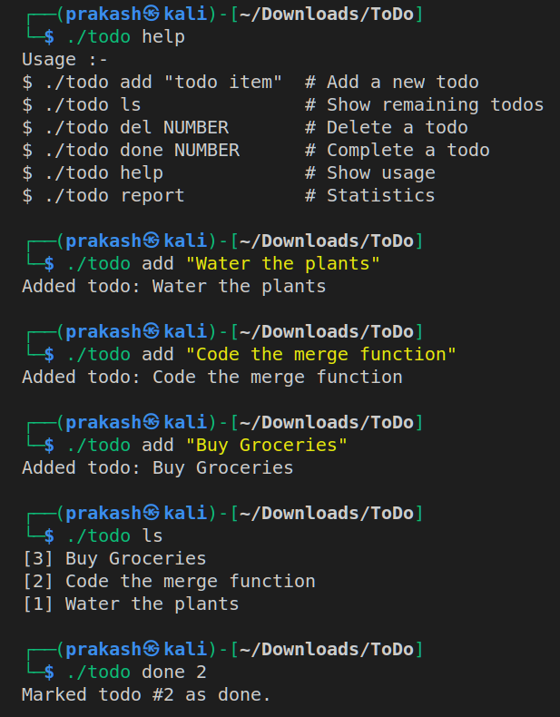
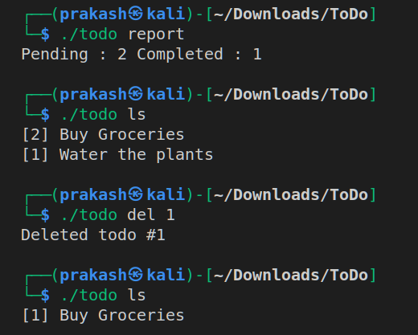

# To-Do
A simple To-Do type command line based program made in python.

## Requirements :- 

- Python3

 ## Output :- 
   
   
   
   
   
## Getting Started :-

### For Linux >

- Download or clone repository.
- Fire up the terminal and enter into this repo directory(or folder).
- Run the todo.py file by **python3 todo.py** along with arguments or create symbolic link by **ln -s todo.sh todo** & then use it directly by **./todo** along with arguments.

### For Windows >

- Download or clone repository.
- Launch up the cmd (with administrator privileges) and enter into this repo directory(or folder) .
- Run the todo.py file by **python3 todo.py** along with arguments or create symbolic link by **mklink todo todo.bat**, then run it.

## Bugs and Improvements :-

- No known bugs.
- Will soon add other features like desktop notfication etc.

## Dev :- Prakash Gupta
